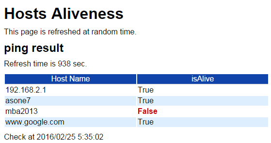

# ps1ping.ps1

## 概要
PowerShell を用いて延々と、10分から30分範囲のランダムなタイミングで疎通確認して結果を html ファイルに出力するだけのスクリプト。



## 使い方
引数なしは Google と Microsoft に ping します。
```
PS> ps1ping.ps1
or
PS> ps1ping.ps1 -inputfile C:\path\to\file
or
PS> ps1ping.ps1 -servers 192.168.1.1,www.example.com,winsname
```

## 備考
- 無通信状態が長いと、たまに ISP の認証エラーが起こりインターネットに出られなくなる傾向がある(ようなないような)
- じゃあ試しに無通信状態が長くならないようにしてみて様子見してみよう
- 壊れても気にならなくて暇を持て余している低電力マシンが Windows だった

ってことで PowerShell と。
